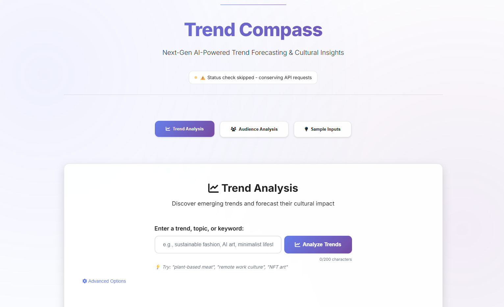

# Trend Compass AI

An AI-powered trend forecasting and audience insights tool that demonstrates the combined power of Qloo's cultural affinity data and Google's Gemini LLM.



## 🚀 Live Website & Deployment

- **Live Website:** [https://trend-compass-ai.onrender.com/](https://trend-compass-ai.onrender.com/)
- **Video:** [https://youtu.be/Q0bDZkC0M8w](https://youtu.be/Q0bDZkC0M8w)

## ✨ Project Overview

**Trend Compass AI** is a cutting-edge application designed to help businesses and creators understand the world around them. By leveraging Qloo's unique cultural intelligence—the world's most advanced graph of consumer preferences—and the analytical power of an LLM, our platform delivers actionable trend analysis and audience insights with unprecedented depth and speed.

**Key Features:**
- **Trend Analysis**: Get forecasts and insights about emerging trends across industries.
- **Audience Insights**: Understand the cultural affinities and preferences of different audience segments.
- **AI-Powered Recommendations**: Receive actionable recommendations for marketing and content creation.
- **Intuitive UI**: A clean, responsive interface built with Vite and TypeScript for a premium user experience.

## 🛠️ Tech Stack

- **Frontend**: Vite + TypeScript, HTML, CSS (with responsive design and theming)
- **Backend**: Python with FastAPI
- **AI**: Google's Gemini API (LLM)
- **Data**: Qloo Cultural Affinity API
- **Deployment**: Render

## 💡 Our Development Journey: Challenges & Learnings

Building Trend Compass for this hackathon was a challenging but rewarding process, especially as a new developer to this specific tech stack. I encountered several key challenges that shaped our final product:

1.  **The Deployment Maze**: I  initially struggled to deploy our Python backend. I tried deploying the static frontend to platforms like Netlify and the backend separately, which resulted in numerous errors and a lot of debugging time. I quickly realized that our full-stack Python application required a different kind of hosting. This led us to switch to **Render**, which was a fantastic discovery, offering seamless support for Python web services like FastAPI.
2.  **Frontend Workflow**: Our initial static HTML, CSS, and JS frontend worked well locally, but it wasn't scalable or easy to deploy. The decision to switch to **Vite with TypeScript** was a game-changer. It streamlined our development process with hot reloading and provided a more robust, modern foundation for our UI, which ultimately led to the polished, responsive interface you see today.
3.  **API Integration**: Learning to connect two new and powerful APIs—**FastAPI** for our backend, and then integrating both the **Qloo and Gemini APIs**—presented a steep learning curve. The process wasn't easy, but through perseverance, we built a robust backend that successfully orchestrates data from both services to create the valuable reports you'll see in the demo.

This journey taught us the importance of choosing the right tools for the job and the value of a flexible, problem-solving mindset.

## 🔧 Getting Started (For Local Development)

### Prerequisites

- Python 3.9+
- Gemini API key
- Qloo API key
- Node.js & npm

### Installation

1.  Clone the repository and navigate into the folder:
    ```bash
    git clone [https://github.com/yourusername/trend-compass.git](https://github.com/yourusername/trend-compass.git)
    cd trend-compass
    ```

2.  Set up the backend:
    ```bash
    # Create and activate a Python virtual environment
    python -m venv venv
    .\venv\Scripts\activate
    
    # Install Python dependencies
    pip install -r backend/requirements.txt
    ```

3.  Set up the frontend:
    ```bash
    # Navigate to the frontend directory
    cd frontend/
    
    # Install Node.js dependencies
    npm install
    ```

4.  Create a `.env` file in the **backend directory** (`trend-compass/backend/.env`):
    ```
    GEMINI_API_KEY=your_gemini_api_key_here
    QLOO_API_KEY=your_qloo_api_key_here
    ```

5.  Start the backend server:
    ```bash
    # From the backend directory
    uvicorn main:app --reload
    ```

6.  Start the frontend development server:
    ```bash
    # From the frontend directory
    npm run dev
    ```

## 📋 Project Structure

```
trend-compass/
├── frontend/              # Vite + TypeScript Frontend
│   ├── src/               # Source code
│   │   └── ...
│   ├── public/            # Static assets
│   ├── package.json       # Frontend dependencies
│   └── ...
├── backend/               # Python FastAPI Backend
│   ├── main.py            # API entry point
│   ├── requirements.txt   # Python dependencies
│   └── ...
├── .gitignore             # Files to ignore from Git
└── README.md              # Project documentation

```

## 🧪 API Documentation

When the backend is running locally, you can access the interactive API documentation (Swagger UI) at `http://localhost:8000/docs`.

## 🤝 Contributing

This is a hackathon project, but suggestions for improvements are always welcome!

## 📄 License

[MIT License](LICENSE)

## 📬 Contact

Email: nishanajihah.dev@gmail.com

Project Link: [https://github.com/nishanajihah/trend-compass-ai](https://github.com/nishanajihah/trend-compass-ai)